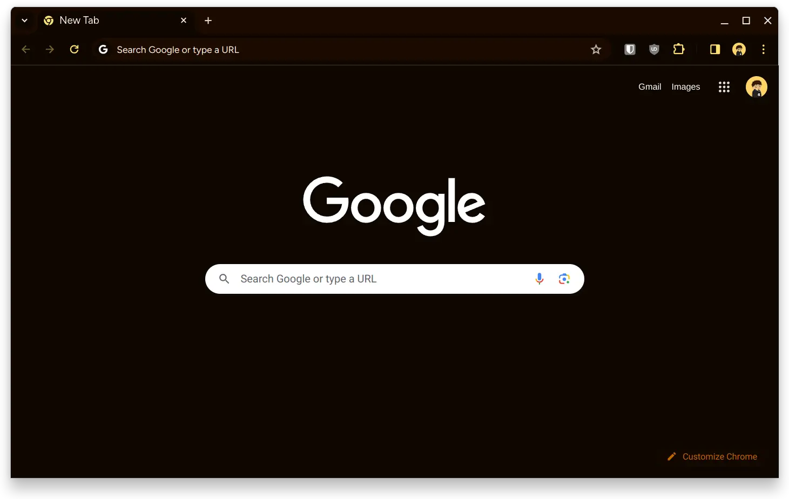
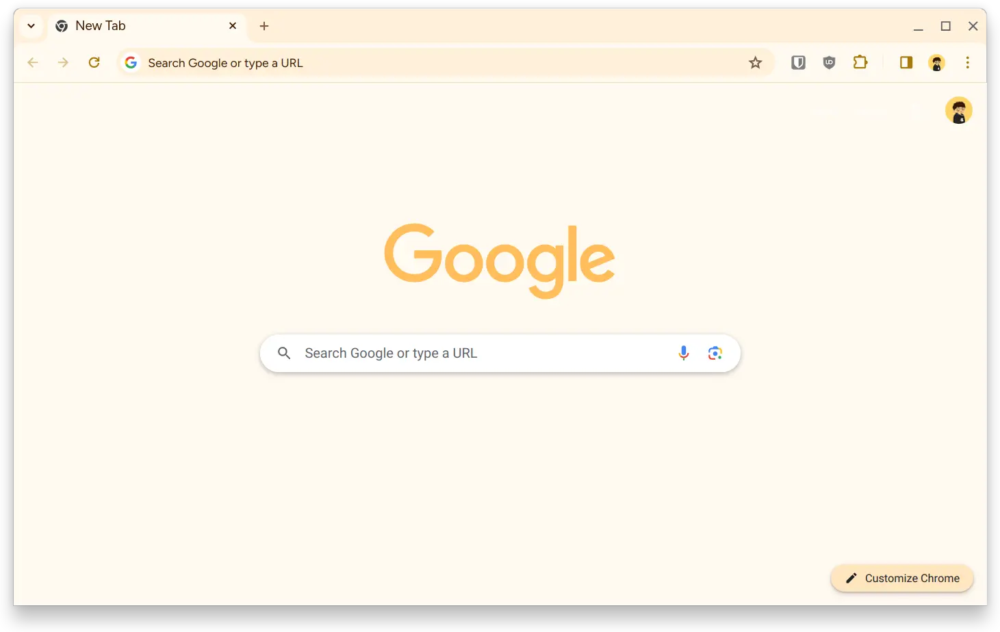

<div align="center">


### Whiskers for [Chrome](https://www.google.com/chrome/)

<div>
    
    
</div>
</div>

## 👷‍♂️ Install

- Clone this repository

```sh
git clone https://github.com/Whiskers-Color-Scheme/chrome
```

- Go to `chrome://extensions/` and enable developer mode
- Click on `load unpacked` and select one of the themes inside from the cloned directory
- Now you can disabled developer mode if needed

## 💻 Maintainers

- [lighttigerXIV](https://github.com/lighttigerxiv)